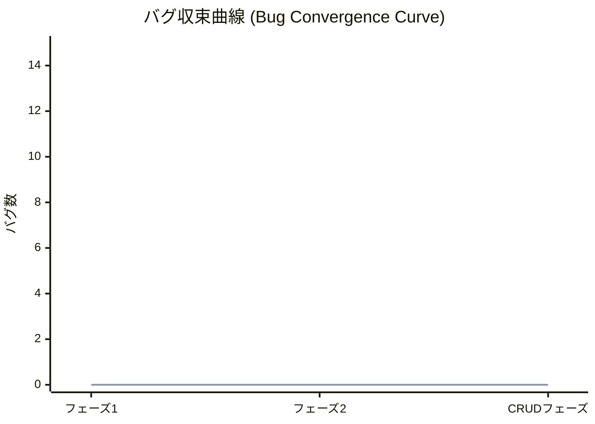

# バグ管理・品質可視化レポート (Bug Tracking & Quality Metrics)

## 1. バグ管理表
発見された不具合をこちらで起票し、修正状況を管理します。

| ID | 発見日 | 発生機能 | 内容 | 優先度 | ステータス | 修正日 |
|:---|:---|:---|:---|:---:|:---:|:---|
| (例) B-01 | 2026/03/04 | タスク管理 | ステータス更新時にエラー | 高 | 進行中 | - |

## 2. 品質可視化 (バグ収束率)
試験総数に対する累積バグ発見数と、未解消バグ数の推移を記録します。

### 統計サマリー
- **累計試験数**: 13
- **累計バグ発見数**: 0
- **未解消バグ数**: 0
- **バグ収束率**: 100% (バグなし/試験数)

### 収束曲線 (Mermaid)

> ※ 青線: 累積バグ数、赤線: 未解消バグ数（今後更新）

## 3. 分析・対策
現在の品質状況に関する分析と、今後必要となる対策を記述します。
- **分析**: 現在のところ、TDDによる早期バグ発見により、結合試験段階での不具合は発生していません。
- **対策**: CRUD機能実装に伴い複雑性が増すため、境界値テストを重点的に追加します。
